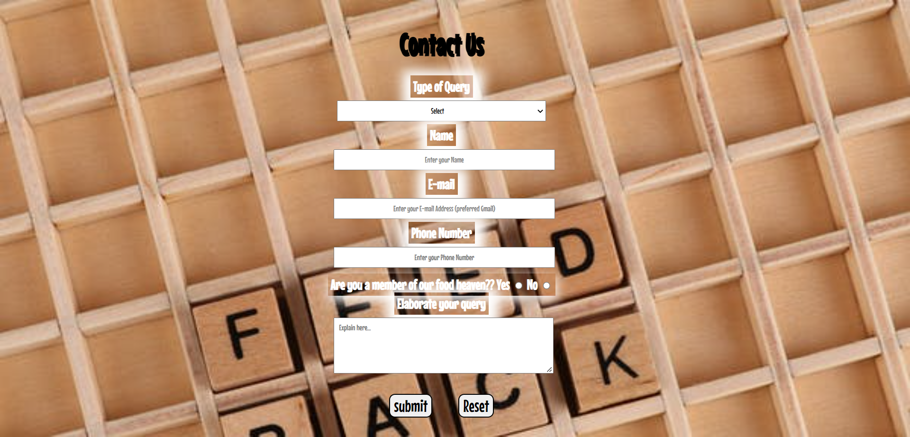

# Food-Heaven
A static restaurant website named Food Heaven!!
Skills used -> HTML, CSS(Flexbox and Grid layout), Git and Github, VSCode(Platform)

This is a practice project to showcase the current level of my skills
It is clearly visible through the project that I have understood the basics of HTML and CSS, which includes some typical topics like Flexbox and Grid layout usage in CSS, Form Designing, Usage of @media queries, CSS style attribute properties, Hosting project on Github using CLI and GUI and much more...
And most important thing in today's website is Resposiveness which is specially taken care of here. 

#Below is the glimpse of my project #FOOD HEAVEN

#Contact Page

